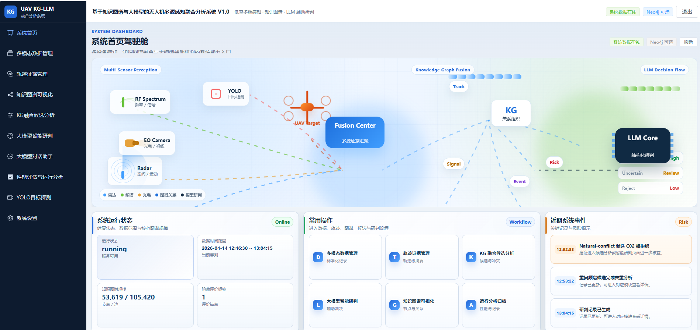

# UAV-KGLLM-Web

**基于知识图谱与大模型的无人机多源感知融合分析系统**

UAV Multi-Source Perception Fusion Analysis System based on Knowledge Graph & LLM

[](LICENSE) [](https://www.python.org/) [](https://fastapi.tiangolo.com/) [](https://vuejs.org/) [](https://vitejs.dev/) [](https://neo4j.com/)

## 项目简介

面向无人机多源感知数据的融合分析平台，结合知识图谱（KG）与大语言模型（LLM），围绕雷达、频谱、光电、识别等多模态数据，提供从数据管理、轨迹证据、知识图谱可视化、融合候选分析、大模型智能研判到研判报告生成的完整分析闭环。

系统开箱即用：后端启动时自动加载已有数据，缺少真实数据文件时自动生成完整演示数据，无需数据库或外部 LLM API 即可运行演示。



## 功能特性

- 登录认证与系统数据驾驶舱
- 多模态数据管理（雷达 / 频谱 / 光电 / 识别）
- 轨迹证据管理与特征雷达图可视化
- 知识图谱可视化（本地 CSV 或 Neo4j 数据源）
- KG 融合候选分析与候选评估
- 大模型智能研判（内置确定性规则引擎，可选接外部 LLM API）
- 大模型对话助手
- 实验结果对比分析
- 研判报告生成
- YOLO 目标检测工作台（基于 Ultralytics）

## 技术栈

| 层 | 技术 |
| --- | --- |
| 前端 | Vue 3 · Element Plus · ECharts · Axios · Vite |
| 后端 | Python · FastAPI · Pandas · Uvicorn |
| 数据 | JSON / JSONL / CSV（可选 Neo4j 图数据库） |

## 快速开始

环境要求：Python 3.10+、Node.js 18+。

```bash
# 1. 启动后端
cd backend
pip install -r requirements.txt
uvicorn main:app --reload --port 8000

# 2. 启动前端
cd ../frontend
npm install
npm run dev
```

浏览器访问 **http://localhost:5173**，默认账号 `admin / 123456`。

后端 API 文档：http://localhost:8000/docs

## 项目结构

```text
backend/
├── main.py          # FastAPI 应用入口
├── routers/         # API 路由（auth / dashboard / data / tracks / kg /
│                    #   fusion / llm / chat / experiments / settings / yolo）
├── services/        # 业务服务（数据装载、融合引擎、LLM 研判、图谱服务等）
└── data/            # 数据文件（可替换为真实数据，缺失时自动生成演示数据）

frontend/
├── src/
│   ├── views/       # 页面组件（登录、驾驶舱、数据管理、图谱、研判、报告等）
│   ├── api/         # Axios 接口封装
│   └── router/      # 路由配置
└── vite.config.js
```

## Neo4j（可选）

系统设置中可启用 Neo4j 作为图谱数据源（默认 `bolt://localhost:7687`，用户 `neo4j` / 密码 `12345678`）。数据库不可用时自动回落到本地 CSV 图谱，不影响系统运行。

## License

本项目基于 **Apache License 2.0** 开源，详见 [LICENSE](LICENSE)。已申请中国计算机软件著作权登记，请保留版权信息。

Copyright © 2026 UAV-KGLLM-Web Contributors
